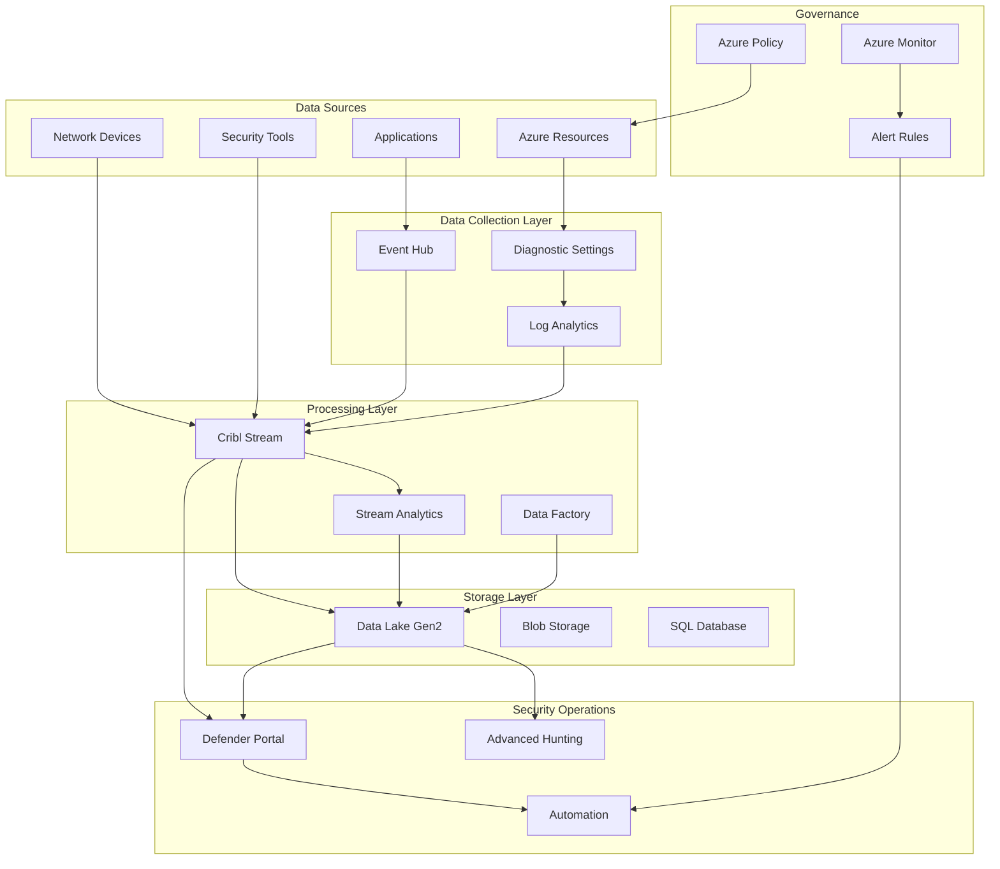

# Technical Architecture Document

## Azure Infrastructure Security & Operations Platform

### 1. High-Level Architecture



---

## 2. Infrastructure as Code Architecture

### 2.1 Repository Structure

```
azure-infrastructure/
├── .github/
│   └── workflows/
│       ├── terraform-plan.yml
│       ├── terraform-apply.yml
│       └── policy-compliance.yml
├── modules/
│   ├── alerts/
│   │   ├── main.tf
│   │   ├── variables.tf
│   │   ├── outputs.tf
│   │   └── README.md
│   ├── policies/
│   │   ├── security/
│   │   ├── compliance/
│   │   └── cost/
│   └── monitoring/
│       ├── action-groups/
│       ├── log-queries/
│       └── dashboards/
├── environments/
│   ├── global/
│   │   └── terraform.tfvars
│   ├── dev/
│   │   ├── main.tf
│   │   ├── terraform.tfvars
│   │   └── backend.tf
│   ├── staging/
│   └── production/
├── scripts/
│   ├── init-backend.sh
│   ├── validate-policies.ps1
│   └── export-alerts.py
└── tests/
    ├── unit/
    ├── integration/
    └── compliance/
```

### 2.2 Terraform Module Design

```hcl
# Example Alert Module Structure
module "metric_alerts" {
  source = "../../modules/alerts"
  
  resource_group_name = var.resource_group_name
  location           = var.location
  
  alerts = {
    cpu_high = {
      name              = "High CPU Usage"
      description       = "Alert when CPU exceeds 80%"
      target_resource   = var.vm_id
      metric_namespace  = "Microsoft.Compute/virtualMachines"
      metric_name       = "Percentage CPU"
      aggregation       = "Average"
      operator          = "GreaterThan"
      threshold         = 80
      frequency         = "PT5M"
      window_size       = "PT15M"
      severity          = 2
      action_group_ids  = [azurerm_monitor_action_group.ops_team.id]
    }
  }
  
  tags = var.tags
}
```

### 2.3 Policy as Code Structure

```json
{
  "policyDefinitions": [
    {
      "name": "require-tag-on-rg",
      "displayName": "Require tag on resource groups",
      "description": "Enforces existence of a tag on resource groups",
      "mode": "All",
      "metadata": {
        "category": "Governance",
        "version": "1.0.0"
      },
      "parameters": {
        "tagName": {
          "type": "String",
          "metadata": {
            "displayName": "Tag Name",
            "description": "Name of the tag, such as 'environment'"
          }
        }
      },
      "policyRule": {
        "if": {
          "allOf": [
            {
              "field": "type",
              "equals": "Microsoft.Resources/subscriptions/resourceGroups"
            },
            {
              "field": "[concat('tags[', parameters('tagName'), ']')]",
              "exists": "false"
            }
          ]
        },
        "then": {
          "effect": "deny"
        }
      }
    }
  ]
}
```

---

## 3. Cribl Stream Architecture

### 3.1 Deployment Topology

```yaml
Deployment:
  Leader Nodes:
    Count: 2 (Active/Standby)
    Size: Standard_D4s_v3
    Storage: Premium SSD 256GB
    Location: Primary Region
    
  Worker Groups:
    Production:
      Count: 4-12 (Auto-scaling)
      Size: Standard_D8s_v3
      Storage: Premium SSD 512GB
      Locations: 
        - Primary Region (75%)
        - Secondary Region (25%)
    
    Development:
      Count: 2
      Size: Standard_D2s_v3
      Storage: Standard SSD 128GB
      Location: Primary Region

Network:
  VNet Integration: Yes
  Private Endpoints: Enabled
  Load Balancer: Azure Application Gateway
  SSL/TLS: End-to-end encryption
```

### 3.2 Data Pipeline Configuration

```javascript
// Cribl Pipeline Example: Azure Security Logs
exports.name = 'Azure Security Logs Pipeline';
exports.type = 'pipeline';
exports.description = 'Process and route Azure security logs';

exports.conf = {
  functions: [
    {
      id: 'parser',
      filter: "sourcetype=='azure:security'",
      conf: {
        mode: 'extract',
        type: 'json',
        srcField: '_raw',
        dstField: 'parsed'
      }
    },
    {
      id: 'eval',
      filter: "true",
      conf: {
        add: [
          {
            name: 'severity_label',
            value: `
              case(severity == 0, 'Critical',
                   severity == 1, 'Error',
                   severity == 2, 'Warning',
                   severity == 3, 'Informational',
                   'Unknown')
            `
          }
        ]
      }
    },
    {
      id: 'mask',
      filter: "parsed.properties.email",
      conf: {
        rules: [
          {
            matchRegex: /([a-zA-Z0-9._%+-]+)@[a-zA-Z0-9.-]+\.[a-zA-Z]{2,}/,
            replaceExpr: "'***@***.**'"
          }
        ]
      }
    },
    {
      id: 'sampling',
      filter: "severity > 2",
      conf: {
        rate: 10  // Keep 1 in 10 informational logs
      }
    },
    {
      id: 'route',
      filter: "true",
      conf: {
        routes: [
          {
            name: 'critical_alerts',
            filter: "severity <= 1",
            output: 'defender_high_priority'
          },
          {
            name: 'standard_logs',
            filter: "severity > 1",
            output: 'data_lake_standard'
          }
        ]
      }
    }
  ]
};
```

### 3.3 Retention Strategy Configuration

```yaml
Retention Tiers:
  Hot Tier:
    Duration: 30 days
    Storage: Premium SSD
    Access: Real-time
    Compression: None
    Use Cases:
      - Active investigations
      - Real-time monitoring
      - Alert correlation
  
  Warm Tier:
    Duration: 90 days
    Storage: Standard SSD
    Access: < 5 minutes
    Compression: Snappy
    Use Cases:
      - Recent investigations
      - Compliance queries
      - Trend analysis
  
  Cool Tier:
    Duration: 365 days
    Storage: Standard HDD
    Access: < 1 hour
    Compression: GZIP
    Use Cases:
      - Historical analysis
      - Annual audits
      - Forensics
  
  Archive Tier:
    Duration: 7 years
    Storage: Archive Blob
    Access: < 24 hours
    Compression: GZIP Maximum
    Use Cases:
      - Regulatory compliance
      - Legal hold
      - Long-term retention
```

---

## 4. Data Lake Architecture

### 4.1 Storage Structure

```
datalake/
├── raw/
│   ├── security/
│   │   ├── year=2025/
│   │   │   ├── month=01/
│   │   │   │   ├── day=14/
│   │   │   │   │   ├── hour=00/
│   │   │   │   │   │   └── *.parquet
│   ├── audit/
│   ├── application/
│   └── network/
├── processed/
│   ├── enriched/
│   │   ├── security_enriched/
│   │   └── audit_enriched/
│   ├── aggregated/
│   │   ├── hourly/
│   │   ├── daily/
│   │   └── monthly/
│   └── normalized/
├── curated/
│   ├── incidents/
│   ├── investigations/
│   ├── threat_intel/
│   └── compliance/
└── sandbox/
    └── analyst_queries/
```

### 4.2 Data Processing Architecture

```python
# Azure Function for Data Processing
import json
import logging
from datetime import datetime
from azure.storage.blob import BlobServiceClient
from azure.eventhub import EventHubConsumerClient
from azure.identity import DefaultAzureCredential

class SecurityLogProcessor:
    def __init__(self):
        self.credential = DefaultAzureCredential()
        self.blob_service = BlobServiceClient(
            account_url="https://datalake.blob.core.windows.net",
            credential=self.credential
        )
        
    def process_event(self, partition_context, event):
        """Process incoming security event"""
        try:
            # Parse event data
            data = json.loads(event.body_as_str())
            
            # Enrich data
            enriched_data = self.enrich_event(data)
            
            # Determine storage path
            path = self.get_storage_path(enriched_data)
            
            # Write to Data Lake
            self.write_to_lake(path, enriched_data)
            
            # Update checkpoint
            partition_context.update_checkpoint(event)
            
        except Exception as e:
            logging.error(f"Error processing event: {e}")
            
    def enrich_event(self, data):
        """Add enrichment data to event"""
        data['processed_timestamp'] = datetime.utcnow().isoformat()
        data['risk_score'] = self.calculate_risk_score(data)
        data['geo_location'] = self.get_geo_location(data.get('ip_address'))
        return data
        
    def calculate_risk_score(self, data):
        """Calculate risk score based on event attributes"""
        score = 0
        if data.get('severity') == 'Critical':
            score += 50
        if data.get('user_risk') == 'High':
            score += 30
        if data.get('anomaly_detected'):
            score += 20
        return min(score, 100)
```

### 4.3 Query Optimization

```sql
-- Optimized table structure for Synapse Analytics
CREATE TABLE security_events
(
    event_id VARCHAR(100) NOT NULL,
    timestamp DATETIME2 NOT NULL,
    event_type VARCHAR(50),
    severity VARCHAR(20),
    source_ip VARCHAR(45),
    destination_ip VARCHAR(45),
    user_principal VARCHAR(200),
    resource_id VARCHAR(500),
    operation VARCHAR(200),
    result VARCHAR(20),
    risk_score INT,
    raw_data VARCHAR(MAX)
)
WITH
(
    DISTRIBUTION = HASH(event_id),
    CLUSTERED COLUMNSTORE INDEX,
    PARTITION (timestamp RANGE RIGHT FOR VALUES (
        '2025-01-01', '2025-02-01', '2025-03-01',
        '2025-04-01', '2025-05-01', '2025-06-01'
    ))
);

-- Create statistics for query optimization
CREATE STATISTICS stat_severity ON security_events(severity);
CREATE STATISTICS stat_event_type ON security_events(event_type);
CREATE STATISTICS stat_timestamp ON security_events(timestamp);
```

---

## 5. Microsoft Defender Integration

### 5.1 Defender Portal Configuration

```yaml
Defender Components:
  Microsoft 365 Defender:
    - Defender for Endpoint
    - Defender for Office 365
    - Defender for Identity
    - Defender for Cloud Apps
    
  Defender for Cloud:
    - CSPM (Cloud Security Posture Management)
    - CWPP (Cloud Workload Protection)
    - DevOps Security
    - Container Security
    
  Integration Points:
    - Azure Sentinel Connector (Migration)
    - Data Lake Connector
    - Cribl Stream Output
    - Logic Apps Integration
```

### 5.2 Advanced Hunting Queries (KQL)

```kusto
// Detect suspicious Azure AD sign-ins with Data Lake correlation
let SuspiciousIPs = 
    externaldata(ip:string)
    [@"https://datalake.blob.core.windows.net/threat-intel/suspicious-ips.csv"]
    with (format="csv");
let RiskScore = 75;
SigninLogs
| where TimeGenerated > ago(24h)
| where ResultType != 0  // Failed sign-ins
| join kind=inner SuspiciousIPs on $left.IPAddress == $right.ip
| extend GeoLocation = geo_info(IPAddress)
| where RiskScore > 70
| project 
    TimeGenerated,
    UserPrincipalName,
    IPAddress,
    GeoLocation,
    ResultType,
    ResultDescription,
    AppDisplayName,
    DeviceDetail,
    RiskScore
| order by TimeGenerated desc

// Correlate security alerts across multiple sources
let AlertSeverity = "High";
SecurityAlert
| where TimeGenerated > ago(7d)
| where AlertSeverity == AlertSeverity
| extend EntityType = parse_json(Entities)[0].Type
| join kind=inner (
    SecurityIncident
    | where TimeGenerated > ago(7d)
    | extend IncidentEntities = parse_json(RelatedEntities)
) on $left.SystemAlertId == $right.AlertIds
| summarize 
    AlertCount = count(),
    UniqueEntities = dcount(EntityType),
    Products = make_set(ProductName),
    Tactics = make_set(Tactics)
    by IncidentNumber, Title, Severity
| where AlertCount > 3
| order by AlertCount desc
```

### 5.3 Automation Workflows

```json
{
  "definition": {
    "$schema": "https://schema.management.azure.com/schemas/2016-06-01/workflowdefinition.json#",
    "contentVersion": "1.0.0.0",
    "triggers": {
      "When_a_Defender_alert_is_created": {
        "type": "ApiConnectionWebhook",
        "inputs": {
          "host": {
            "connection": {
              "name": "@parameters('$connections')['microsoftdefender']['connectionId']"
            }
          },
          "body": {
            "callback_url": "@{listCallbackUrl()}"
          },
          "path": "/incident/creation"
        }
      }
    },
    "actions": {
      "Parse_Alert": {
        "type": "ParseJson",
        "inputs": {
          "content": "@triggerBody()",
          "schema": {
            "type": "object",
            "properties": {
              "alertId": { "type": "string" },
              "severity": { "type": "string" },
              "entities": { "type": "array" }
            }
          }
        }
      },
      "Enrich_with_DataLake": {
        "type": "Http",
        "inputs": {
          "method": "POST",
          "uri": "https://datalake-api.azure.com/enrich",
          "body": {
            "entities": "@body('Parse_Alert')?['entities']"
          }
        }
      },
      "Create_ServiceNow_Ticket": {
        "type": "ApiConnection",
        "inputs": {
          "host": {
            "connection": {
              "name": "@parameters('$connections')['servicenow']['connectionId']"
            }
          },
          "method": "post",
          "path": "/incident/create",
          "body": {
            "short_description": "@body('Parse_Alert')?['title']",
            "description": "@body('Enrich_with_DataLake')?['enrichedData']",
            "priority": "@if(equals(body('Parse_Alert')?['severity'], 'High'), 1, 3)",
            "assignment_group": "Security Operations"
          }
        }
      }
    }
  }
}
```

---

## 6. Monitoring & Observability

### 6.1 Metrics Collection

```yaml
Key Metrics:
  Infrastructure:
    - Resource utilization (CPU, Memory, Disk, Network)
    - Availability and uptime
    - Response times and latency
    - Error rates
    
  Security:
    - Alert volume and trends
    - Mean time to detect (MTTD)
    - Mean time to respond (MTTR)
    - False positive rate
    
  Data Pipeline:
    - Ingestion rate (events/second)
    - Processing latency
    - Data reduction percentage
    - Storage growth rate
    
  Cost:
    - Resource consumption by service
    - Data transfer costs
    - Storage costs by tier
    - License utilization
```

### 6.2 Dashboard Configuration

```json
{
  "dashboardName": "Security Operations Dashboard",
  "tiles": [
    {
      "type": "MetricChart",
      "title": "Alert Volume Trend",
      "query": "SecurityAlert | summarize count() by bin(TimeGenerated, 1h)",
      "timeRange": "24h"
    },
    {
      "type": "KPITile",
      "title": "Active Incidents",
      "query": "SecurityIncident | where Status == 'Active' | count",
      "threshold": { "warning": 10, "critical": 20 }
    },
    {
      "type": "PieChart",
      "title": "Alerts by Severity",
      "query": "SecurityAlert | summarize count() by AlertSeverity"
    },
    {
      "type": "Table",
      "title": "Top Attack Techniques",
      "query": "SecurityAlert | summarize Count=count() by AttackTechnique | top 10 by Count"
    }
  ]
}
```

---

## 7. Security Architecture

### 7.1 Zero Trust Model

```yaml
Identity:
  - Azure AD Conditional Access
  - Multi-Factor Authentication
  - Privileged Identity Management
  - Identity Protection

Device:
  - Device compliance policies
  - Intune device management
  - Defender for Endpoint

Application:
  - App protection policies
  - Cloud App Security
  - API security

Data:
  - Information protection
  - Data loss prevention
  - Encryption at rest/transit

Infrastructure:
  - Network segmentation
  - Private endpoints
  - Azure Firewall
  - DDoS protection

Network:
  - Zero Trust Network Access
  - Software-defined perimeter
  - Micro-segmentation
```

### 7.2 Encryption & Key Management

```yaml
Encryption Strategy:
  Data at Rest:
    Storage: AES-256
    Database: TDE (Transparent Data Encryption)
    Backups: AES-256
    
  Data in Transit:
    External: TLS 1.3
    Internal: IPSec/mTLS
    
  Key Management:
    Service: Azure Key Vault
    HSM: Dedicated HSM for critical keys
    Rotation: Automated 90-day rotation
    Access: RBAC + Conditional Access
```

---

## 8. Disaster Recovery & Business Continuity

### 8.1 Recovery Strategy

```yaml
RPO/RTO Targets:
  Critical Systems:
    RPO: 15 minutes
    RTO: 1 hour
    
  Standard Systems:
    RPO: 4 hours
    RTO: 8 hours
    
Backup Strategy:
  Frequency:
    - Configuration: Every change (Git)
    - Data Lake: Continuous (GRS)
    - Databases: Every 4 hours
    
  Retention:
    - Daily: 7 days
    - Weekly: 4 weeks
    - Monthly: 12 months
    - Yearly: 7 years
    
Failover Process:
  1. Detection (automated monitoring)
  2. Assessment (incident commander)
  3. Decision (stakeholder approval)
  4. Execution (automated runbooks)
  5. Validation (smoke tests)
  6. Communication (status page)
```

### 8.2 Multi-Region Architecture

```yaml
Primary Region: East US
  - All production workloads
  - Active data processing
  - Primary storage
  
Secondary Region: West US
  - Standby infrastructure
  - Replicated data (async)
  - Read-only access
  
Failover Strategy:
  - DNS-based routing (Azure Traffic Manager)
  - Database geo-replication
  - Storage account GRS
  - Cross-region load balancing
```

---

## 9. Performance Optimization

### 9.1 Caching Strategy

```yaml
Cache Layers:
  CDN:
    Service: Azure Front Door
    Content: Static assets, API responses
    TTL: 1-24 hours based on content
    
  Redis Cache:
    Service: Azure Cache for Redis
    Use Cases:
      - Session state
      - Query results
      - Temporary data
    Eviction: LRU
    
  Application Cache:
    In-memory caching
    Distributed cache
    Query plan cache
```

### 9.2 Query Optimization

```sql
-- Materialized view for performance
CREATE MATERIALIZED VIEW security_summary
AS
SELECT 
    DATE_TRUNC('hour', timestamp) as hour,
    event_type,
    severity,
    COUNT(*) as event_count,
    AVG(risk_score) as avg_risk_score,
    MAX(risk_score) as max_risk_score
FROM security_events
WHERE timestamp > CURRENT_DATE - INTERVAL '30 days'
GROUP BY DATE_TRUNC('hour', timestamp), event_type, severity
WITH (distribution = hash(hour), clustered columnstore index);

-- Refresh strategy
ALTER MATERIALIZED VIEW security_summary REBUILD;
```

---

## 10. Integration Patterns

### 10.1 API Gateway Configuration

```yaml
API Management:
  Service: Azure API Management
  
  Policies:
    - Rate limiting: 1000 requests/minute
    - Authentication: OAuth 2.0 / API Keys
    - IP whitelisting: Corporate networks only
    - Response caching: 5 minutes
    - Circuit breaker: 5 failures = 30s break
    
  Endpoints:
    /api/alerts:
      GET: Retrieve alerts
      POST: Create alert
      Rate limit: 100/minute
      
    /api/incidents:
      GET: List incidents
      PUT: Update incident
      Rate limit: 50/minute
      
    /api/analytics:
      POST: Run query
      Rate limit: 10/minute
      Timeout: 30 seconds
```

### 10.2 Event-Driven Architecture

```yaml
Event Hub Configuration:
  Namespaces:
    Production:
      Throughput Units: 20
      Auto-inflate: Enabled
      Max TU: 40
      
  Event Hubs:
    security-events:
      Partitions: 32
      Retention: 7 days
      Capture: Enabled (Data Lake)
      
    audit-logs:
      Partitions: 8
      Retention: 30 days
      
  Consumer Groups:
    - cribl-stream
    - defender-portal
    - analytics-engine
    - compliance-archiver
```

---

## Document Control

| Version | Date | Author | Description |
|---------|------|--------|-------------|
| 1.0 | 2025-01-14 | Architecture Team | Initial technical architecture |

---

*End of Technical Architecture Document*